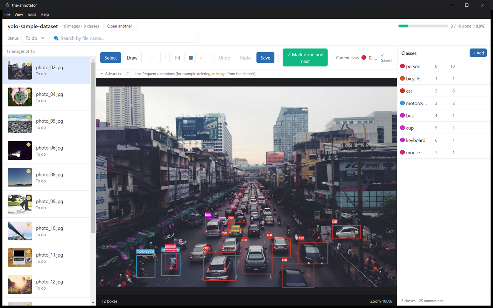
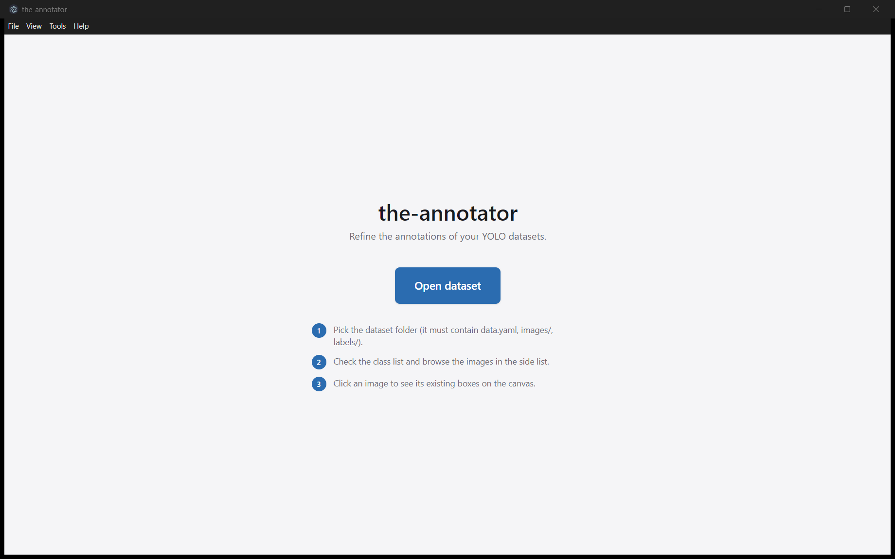
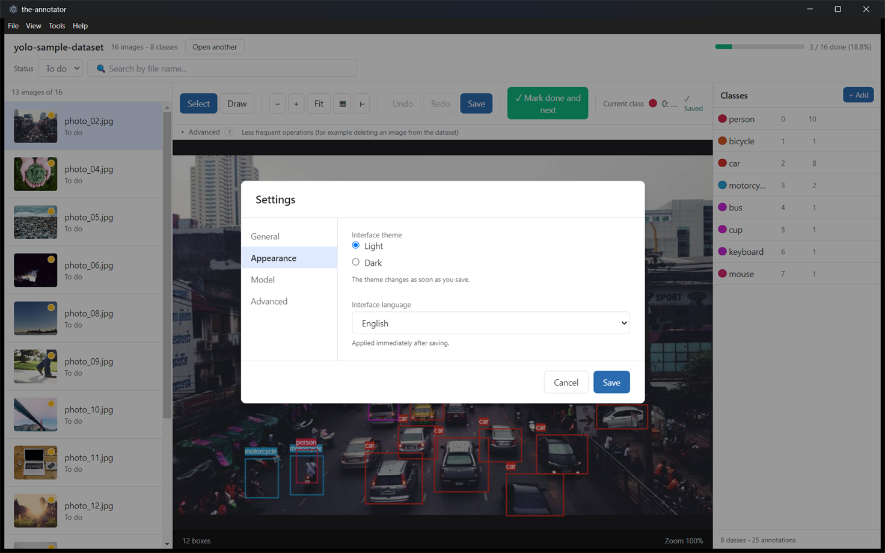
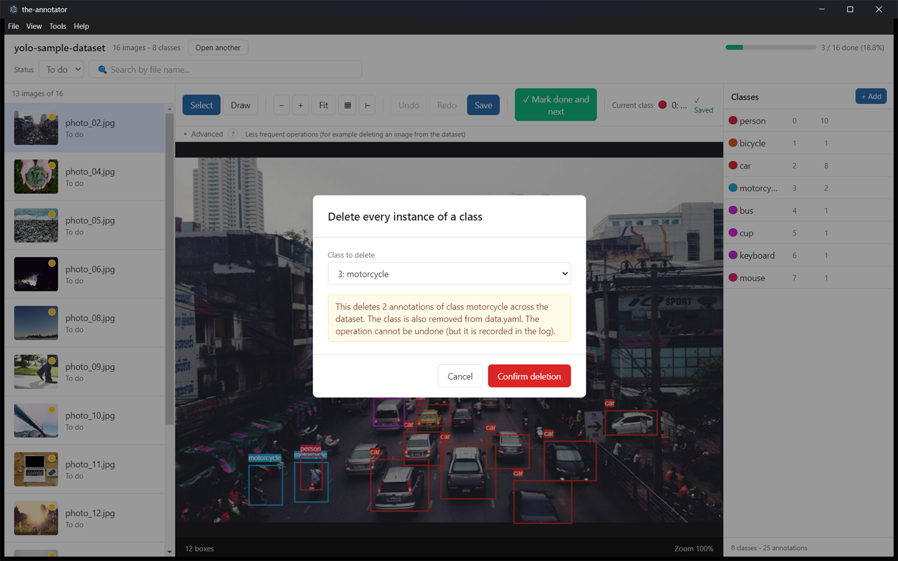

# the-annotator

A desktop editor for YOLO object detection datasets. Open a folder that contains
`data.yaml`, `images/` and `labels/`, review every image in a side list, and fix
the bounding boxes on a zoomable canvas. Everything is saved back to the plain
YOLO `.txt` files you started from.

Fully offline: no account, no cloud, no telemetry, no network access after
installation. Windows 10/11 x64, English and Italian interface.

<!--
  Refreshing the screenshots in docs/screenshots/:
  1. npm run dev
  2. Set the interface to English (View > Language > English): the app follows
     the system language by default, and this README is in English.
  3. Open a dataset with enough images to fill the list and the class counts.
  4. Size the window to about 1470x920 logical pixels. Narrower than that and
     the toolbar wraps and the class sidebar gets cramped.
  5. Capture the window only and save over the existing file, same name.
  Check the result for anything private: the top bar shows the dataset folder
  name, and the list and canvas show real image content.
-->



---

## Why

Most YOLO datasets do not arrive clean. Classes get renamed, two labels turn out
to mean the same thing, a handful of images are unusable, and a few annotations
point at class ids that no longer exist. `the-annotator` is built around that
clean-up pass rather than around labelling from scratch:

- an annotator can work through a large dataset image by image, with a filter for
  what is still to do and a progress bar that survives across sessions;
- whoever owns the dataset can rename, merge, delete and reorder classes across
  every `.txt` file at once, with a preview of the impact, an automatic backup
  and a rollback if anything fails halfway.

---

## Dataset layout

The tool expects a single flat split:

```
<dataset>/
├─ data.yaml          # at least: nc: <N> and names: [...] (list or index map)
├─ images/            # .jpg, .jpeg, .png
└─ labels/            # one .txt per image, YOLO format, may be empty
```

Nested `train/valid/test` folders are **not** supported: split the dataset into
three separate folders and open them one at a time.

While a dataset is open the tool keeps its own state next to it:

```
<dataset>/
├─ .annotation-progress.json              # completed images, class stats, operations log
└─ .annotation-progress-cache/
   ├─ thumbnails/                         # cached list thumbnails
   ├─ backup/<timestamp>-<op>/            # pre-operation backups, kept 30 days
   └─ trash/<timestamp>/                  # deleted images and labels, kept 30 days
```

Your `data.yaml`, `images/` and `labels/` stay in ordinary YOLO format the whole
time, so any other tool in your pipeline keeps working.

---

## Features

**Annotating**

- Image list with thumbnails, file name and status (done / to do / no boxes),
  filterable by status and searchable by file name.
- Canvas with the existing boxes overlaid, coloured per class.
- Select mode: click a box, drag to move it, drag a handle to resize it,
  `Del` to remove it. Boxes are clamped to the image while you drag.
- Draw mode: first click sets one corner, second click sets the opposite one,
  `Esc` cancels. The mode stays active so you can draw several boxes in a row.
- Change the class of the selected boxes with the number keys.
- Undo / redo per image (up to 50 operations).
- Zoom with `Ctrl` + wheel or `+` / `-`, fit to window with `R`.
- Optional pixel grid and edge rulers, for pixel-accurate work at high zoom.
- Mark an image as done and jump to the next pending one with `Space`.

**Saving**

- Autosave shortly after you stop editing, on every image change, and at most
  every 30 seconds during a long editing streak.
- `Ctrl+S` saves immediately.
- Switching image or closing the window with unsaved changes asks first.
- If a write fails, the annotations are dumped to a recovery file under the
  system temp folder and the path is shown in the error.

**Dataset maintenance**

- Bulk operations over every `.txt` at once: delete a class, rename a class,
  merge two classes, remap class ids, reorder classes. Each one previews how
  many annotations it touches, writes a backup first and rolls back on failure.
- Renaming a class onto an existing name offers a merge instead of failing.
- Delete images (one, or a Ctrl/Shift multi-selection) into an internal trash.
- Annotations whose class id does not exist in `data.yaml` are flagged in a
  banner with a jump-to-next button.
- On open, orphan `.txt` files are moved to the trash and images without a `.txt`
  get an empty one, so the dataset stays consistent.
- Backups and trash older than 30 days are cleaned up when a dataset is opened.

**Everything else**

- Light and dark theme.
- English and Italian interface, following the system language by default.
- An operations log inside `.annotation-progress.json`, recording every bulk
  operation and image deletion with a timestamp and a user name.
- A rotating application log for troubleshooting.

---

## Install

Grab the latest `the-annotator-<version>-x64-setup.exe` from the
[releases page](https://github.com/Cepeppe/the-annotator/releases) and run it.
If there is no release published yet, build it yourself with `npm run dist`:
see [Development](#development).

The installer is user-scoped and does not need administrator rights; it installs
into `%LOCALAPPDATA%\Programs\the-annotator\` and puts a shortcut on the
desktop. A portable single-file `.exe` is published alongside it if you would
rather not install anything.

The binaries are not code-signed, so Windows SmartScreen shows a
"Windows protected your PC" warning on first run. Click **More info**, then
**Run anyway**. See [Troubleshooting](#troubleshooting) if your antivirus is more
insistent than that.

---

## First run

1. Click **Open dataset** and pick the folder that contains `data.yaml`,
   `images/` and `labels/`.
2. The image list appears on the left with the **To do** filter preselected, the
   first pending image opens on the canvas, and the class list is on the right.
3. The class highlighted in the right-hand list is the one used for new boxes.
   Click another one, or press its number key, to switch.



Menus worth knowing about:

- **File → Open recent** lists the last 5 datasets.
- **File → Settings** (`Ctrl+,`) holds the user name recorded in the operations
  log, the theme, the interface language and the log folder.
- **View → Theme / Language** switches either one without opening Settings.
- **Tools → Bulk operations** holds the dataset-wide class operations.
- **Tools → Recompute statistics** rescans every `.txt` to refresh the per-class
  counts, after an edit made outside the tool.
- **Help → Keyboard shortcuts** (`F1` or `?`) lists everything below.



---

## Keyboard shortcuts

| Keys | Action |
|---|---|
| `↓` / `J`, `↑` / `K` | Next / previous image |
| `Home`, `End` | First / last image of the current filter |
| `Space` | Mark done and go to the next pending image |
| `Ctrl+Shift+M` | Mark as to do again |
| `S`, `D` | Select mode, Draw mode |
| `Del` / `Backspace` | Delete the selected boxes |
| `Esc` | Clear the selection, or cancel the box being drawn |
| `Ctrl+C` / `Ctrl+V` | Copy / paste boxes |
| `1`-`9`, `0` | Set the class of the selected boxes (classes 0-9) |
| `Ctrl+1`-`Ctrl+0` | Same, for classes 10-19 |
| `Ctrl` + wheel, `+` / `-`, `R` | Zoom in on the cursor, zoom, fit to window |
| `Ctrl+S`, `Ctrl+Z`, `Ctrl+Y` | Save now, undo, redo |
| `Backspace` / `Shift+Del` | Delete the images selected in the list |
| `Ctrl+O`, `Ctrl+,`, `F1` / `?` | Open dataset, Settings, shortcut help |

---

## Bulk class operations

All of them live under **Tools → Bulk operations** and share the same safety net:
pending edits are flushed first, a backup of every file about to change is
written to `.annotation-progress-cache/backup/`, progress is shown in a
cancellable dialog, and a failure rolls every file back.

| Operation | What it does |
|---|---|
| Delete a class | Removes every annotation of that class and drops it from `data.yaml`, compacting the ids after it. |
| Rename a class | Updates `data.yaml` only, so the `.txt` files are untouched. Renaming onto an existing name offers a merge instead. |
| Merge two classes | Reassigns every annotation of the source class to the target, then removes the source and compacts the ids. |
| Remap class ids | Applies several `from → to` reassignments in one batch. |
| Reorder classes | The `↑` / `↓` buttons on a class row change its id and remap every `.txt` accordingly. |



Every operation appends an entry to `operations_log` in
`.annotation-progress.json`, with the counts, a timestamp and the user name from
Settings.

---

## Deleting images

Right-click a thumbnail and pick **Delete from the dataset**, or select several
with `Ctrl`/`Shift` and delete them together. The image and its `.txt` move to
`.annotation-progress-cache/trash/<timestamp>/`, which is kept for 30 days.

There is no restore button yet: copy `images/<name>` and `labels/<name>.txt` from
the trash folder back into the dataset by hand, then reopen the dataset.

The **Advanced** strip under the toolbar also deletes the current image, but
without asking for confirmation. It is collapsed by default for that reason.

---

## Development

Requires **Node.js 20 LTS or newer** and **Windows 10/11 x64** (the build targets
Windows only).

```bash
git clone https://github.com/Cepeppe/the-annotator.git
cd the-annotator
npm install

npm run dev          # start the app with hot reload
npm run typecheck    # tsc over the main and renderer projects
npm run test         # 48 Vitest tests over the pure modules
npm run build        # typecheck, then bundle into out/
```

Packaging:

```bash
npm run icon:gen     # regenerate build/icon.ico (only needed if it is missing)
npm run dist         # NSIS installer + portable .exe into dist/
npm run dist:portable
npm run dist:dir     # unpacked build in dist/win-unpacked/, for inspection
```

### Layout

```
src/
├─ main/          Electron main process
│  ├─ ipc/        IPC handlers, grouped by domain
│  └─ lib/        filesystem work: scanning, saving, bulk ops, trash, logging
├─ preload/       the contextBridge API, the only renderer/main surface
├─ renderer/      React UI
│  ├─ components/ views and dialogs
│  ├─ hooks/      autosave, navigation, keyboard shortcuts
│  ├─ i18n/       locale state and the useT hook
│  └─ state/      Context + useReducer store
└─ shared/        types, YOLO/YAML parsing, geometry, undo stack, i18n catalogs
```

Stack: Electron 33, React 18, TypeScript 5.6 (strict, with
`noUncheckedIndexedAccess`), Fabric.js 7 for the canvas, Vite 5, Tailwind 3,
Vitest 2. State is Context + `useReducer`, and the logger is about 150 lines: no
Redux, no Zustand, no winston.

### Adding a language

1. Copy `src/shared/i18n/it.ts`, translate the values and keep the keys.
2. Register the locale in `src/shared/i18n/types.ts` (`LOCALES`, `INTL_LOCALE`)
   and in `CATALOGS` in `src/shared/i18n/catalog.ts`.
3. Add its name to every catalog under a `language.<code>` key.

`npm run typecheck` fails if a catalog misses a key or invents one, so a partial
translation cannot ship by accident.

---

## Troubleshooting

**"Windows protected your PC" when running the installer.** SmartScreen warns
about every unsigned application. Click **More info**, then **Run anyway**.

**The antivirus quarantines the installer.** Same root cause. Add an exception
for `%LOCALAPPDATA%\Programs\the-annotator\`, or for the portable `.exe`.

**"The selected folder does not look like a valid YOLO dataset".** The folder
must contain all three of `data.yaml`, `images/` and `labels/`. `labels/` may be
empty. If only `data.yaml` is missing, the error dialog offers to create an empty
one for you.

**The trash never empties.** Folders older than 30 days are removed when a
dataset is opened, not on a timer. To clear it by hand, close the tool and delete
`.annotation-progress-cache/trash/` inside the dataset.

**The app shows an unexpected error dialog.** The React error boundary offers to
reload the tool, to copy the error log to the clipboard, or to continue at your
own risk. Persistent logs are at
`%APPDATA%\the-annotator\logs\app-debug.log` (rotating, 10 MB, 5 gzipped
history files), reachable from **Settings → Advanced → Open log folder**.

---

## Known limitations

- Windows x64 only; there is no macOS or Linux build.
- Not code-signed, so SmartScreen warns on first run.
- No auto-update: download the new installer and reinstall.
- No restore-from-trash UI; recovery is a manual file copy.
- Flat datasets only, no `train/valid/test` split.
- No model-assisted pre-labelling. The ONNX model path in Settings is stored but
  not used yet.
- Segmentation, polygons and keypoints are out of scope: bounding boxes only.

---

## License

[MIT](LICENSE).

The screenshots show a throwaway sample dataset built from
[Lorem Picsum](https://picsum.photos) photos (Unsplash License) with
hand-placed boxes.
